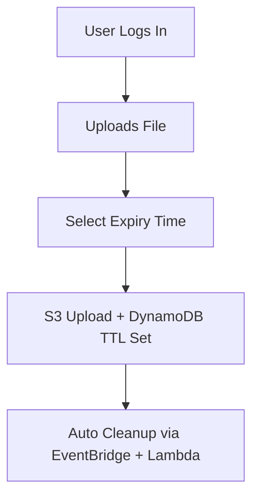

# 🌐 Void Share – Upload. Expire. Forget.


---

## 📌 Project Overview

**Void Share** is a secure, serverless, cloud-native file sharing platform that allows users to upload files of any type, select an expiry duration (from 1 hour up to 5 years), and automatically deletes the files post-expiry. This eliminates clutter, enhances privacy, and removes the need for manual file cleanup. The platform is designed for speed, simplicity, and scalability.

Built entirely on **AWS**, Void Share offers:

* 🔐 Isolated per-user storage using Amazon S3
* ⏳ Auto-expiring file system using DynamoDB TTL
* 🧠 Stateless logic with AWS Lambda and EventBridge
* 🌍 Global content delivery via CloudFront
* 🔄 Fully automated CI/CD pipeline support

---

## 🚀 Key Features

| 🔑 Feature                 | 💡 Description                                            |
| -------------------------- | --------------------------------------------------------- |
| **Authentication**         | Sign up/sign in using Amazon Cognito (OAuth2/JWT-secured) |
| **File Uploading**         | Upload any file type via web UI or REST API               |
| **Custom Expiry**          | Set auto-deletion from 1 hour to 5 years                  |
| **Per-user Folders**       | Files stored under unique user S3 prefixes                |
| **Public/Private Sharing** | Choose visibility for each uploaded file                  |
| **Automatic Cleanup**      | Expired files deleted using Lambda + EventBridge          |
| **Notification Support**   | Email alerts before file expiration (optional via SES)    |
| **Frontend UI**            | React.js + Tailwind CSS responsive design                 |
| **100% Cloud-Hosted**      | Hosted on S3 + CloudFront with API via Gateway            |

---

## ⚙️ Tech Stack Breakdown

| Layer             | Technology                    |
| ----------------- | ----------------------------- |
| **Frontend**      | React.js, Tailwind CSS        |
| **Hosting**       | Amazon S3, CloudFront         |
| **Auth**          | Amazon Cognito                |
| **API Layer**     | AWS Lambda, API Gateway       |
| **Storage**       | Amazon S3                     |
| **Database**      | Amazon DynamoDB (TTL enabled) |
| **Automation**    | AWS EventBridge, Lambda       |
| **Email Service** | Amazon SES (optional)         |
| **IaC & CLI**     | Terraform / AWS CLI           |

---

## 🧠 System Architecture


> The diagram illustrates how each AWS service interacts to maintain a fully serverless lifecycle — from upload to automatic expiry.

---

## 💸 Estimated Monthly Cost

| Service               | Usage Estimate       | Monthly Cost |
| --------------------- | -------------------- | ------------ |
| Amazon S3             | < 20GB stored        | \$1–\$5      |
| AWS Lambda            | < 1 million requests | <\$1         |
| API Gateway           | Light use            | <\$1         |
| Amazon Cognito        | < 50K MAUs           | Free         |
| DynamoDB              | Few hundred items    | <\$1         |
| CloudFront            | Basic CDN traffic    | Free–\$1     |
| Amazon SES (optional) | < 62K emails/month   | Free         |

💡 **Tip**: The project is well under AWS Free Tier. With your **\$180 in AWS credits**, you can run it free for months.

---

## 🔒 Security & Access Control

* 🔐 **Scoped IAM Roles** for file-level isolation
* 🔑 **JWT Tokens** issued via Cognito for every request
* 🛡️ **Private or Public** access option for each file
* 📁 Files stored at: `s3://bucket/uploads/{userId}/filename`
* ❌ Expired files auto-deleted with fail-safe retries

---

## 🗂 Folder Structure

```
voidshare/
├── backend/
│   ├── lambda-upload.js        # Handles file upload metadata
│   ├── lambda-cleanup.js       # Deletes expired files
│   ├── lambda-delete.js        # Manual delete API
│   └── terraform/              # Infrastructure as Code (IaC)
├── frontend/
│   ├── public/
│   └── src/
│       ├── components/         # Reusable UI elements
│       └── pages/              # Routes like /upload, /login, /dashboard
├── assets/
│   └── architecture.png        # AWS architecture diagram
└── README.md
```

---

## 🔁 Upload to Expiry Flow



---

## 🌟 Planned Enhancements

* 🔒 Password-protected file URLs
* 🔄 Extend or renew file expiration
* 🧲 Drag-and-drop + multi-file uploads
* 📊 User dashboard with file stats & history
* 📱 Native mobile app support (React Native or Flutter)
* 🔗 QR Code Generator for share links

---

## 🌍 Deployment (100% AWS Cloud)

```bash
# 1. Deploy Frontend
npm run build
aws s3 sync ./frontend/build s3://your-frontend-bucket/
aws cloudfront create-invalidation --distribution-id YOUR_DIST_ID --paths "/*"

# 2. Deploy Backend APIs
cd backend/terraform
terraform init && terraform apply
```

---

## 👨‍💻 Developer Team

| Name      | Role                 |
| --------- | -------------------- |
| Your Name | Full Stack Cloud Dev |

---

## 🔗 Useful Links

* 🧾 [AWS Free Tier](https://aws.amazon.com/free/)
* 💰 [Amazon S3 Pricing](https://aws.amazon.com/s3/pricing/)
* 🗂️ [DynamoDB TTL Guide](https://docs.aws.amazon.com/amazondynamodb/latest/developerguide/TTL.html)
* 🌐 [Deploying with CloudFront](https://docs.aws.amazon.com/AmazonCloudFront/latest/DeveloperGuide/GettingStarted.html)

---

## 📸 Screenshots (To be updated)

| Upload UI                     | File List                   | Expiry Picker                     |
| ----------------------------- | --------------------------- | --------------------------------- |
|  |  |  |

---

## 📜 License

This project is licensed under the [MIT License](./LICENSE).

---

## 🤝 Contributing

Pull Requests are always welcome! Feel free to open issues for bugs, suggestions, or features. Fork it, star it, and let’s build Void Share together!

---

## ⭐ Support & Recognition

Give this repo a ⭐ if you found it useful or inspiring. Let's make cloud-native file sharing simple, secure, and ephemeral.

> “Upload. Expire. Forget.”
